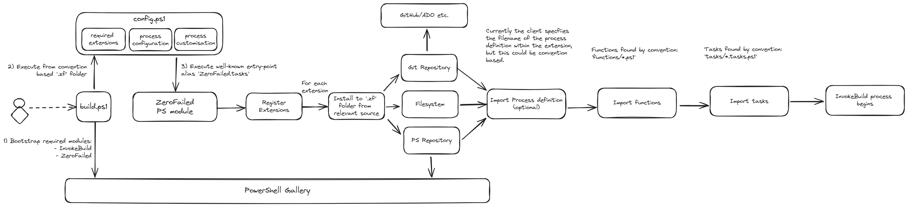

# ZeroFailed

ZeroFailed is an extensible automation framework that aims to help you build flexible and reliable automated processes.

It uses PowerShell Core to enable cross-platform support and using this lower-level toolset allows it to be agnostic about higher-level tools that may consume it (e.g. CI/CD platforms), whilst at the same time being able to integrate with them where desirable.

The framework allows you to build & share your own custom automation functionality, whilst our library of extensions provide opinionated solutions for specific scenarios that have been used to deliver Real World projects.

ZeroFailed uses a Directed Acyclic Graph (DAG) approach to orchestrating these processes, and leverages the excellent [InvokeBuild](https://github.com/nightroman/Invoke-Build) PowerShell module, rather than reinventing the wheel.  For more details on why you might want to design your automated processes around InvokeBuild, please refer to its [wiki](https://github.com/nightroman/Invoke-Build/wiki/Concepts).

As an example, lets consider a software build process. ZeroFailed enables you to:

- Bootstrap and configure the process by adding just 2 files to your repo:
    - A boilerplate entrypoint script that installs the top-level PowerShell module dependencies:
        - [InvokeBuild](https://www.powershellgallery.com/packages/InvokeBuild)
        - [ZeroFailed](https://www.powershellgallery.com/packages/ZeroFailed)
    - A configuration script, by convention stored in `.zf/config.ps1`, that defines:
        - One or more `ZeroFailed` extension modules that implement the functionality needed for the process (and optionally, the process itself)
        - Configuration to drive those extensions for this specific process
        - `InvokeBuild` task definitions for custom functionality specific to this process

Examples of these files can be found [here](./examples/). We also have a [collection of sample repositories](https://github.com/search?q=org%3Azerofailed+ZeroFailed.Sample&type=repositories) that demonstrate how to use many of our extensions.

## Extensions

Extensions are PowerShell modules that follow the conventions below to offer specific features to ZeroFailed processes that consume them.

These features are delivered using 4 different types of component:

1. Functions - regular PowerShell functions to encapsulate functionality consumed by Tasks
1. Tasks - definitions of InvokeBuild tasks
1. Processes - orchestrate a sequence of Tasks to execute as an automated process
1. Properties - configuration settings that control the behaviour of Tasks and Processes

An extension will organise its components as follows:

- Shared functions are defined in a `functions` directory
- Shared InvokeBuild tasks & properties are defined in a `tasks` directory
- OPTIONAL: Dependencies on other extensions are defined in a `dependencies.psd1` file
- OPTIONAL: 1 or more InvokeBuild process definitions - currently these can reside anywhere within the module, with the onus being on the consumer to reference the required path.

For example:
```
<module-root>/
├── functions/
│   ├── functionA.ps1
│   └── functionB.ps1
├── tasks/
│   ├── tasksGroupA.properties.ps1    (a .properties.ps1 file contains variables that can be used to alter the behaviour of the associated tasks)
|   ├── tasksGroupA.tasks.ps1         (a .tasks.ps1 file may contain 1 or more task definitions)
│   ├── tasksGroupB.properties.ps1
│   ├── tasksGroupB.tasks.ps1
│   ├── bigTask.tasks.ps1             (a complex task may be defined in a dedicated code file)
│   └── someProcess.build.ps1
├── dependencies.psd1                 (defines any other extensions this one depends on)
├── MyExtension.psd1
└── MyExtension.psm1
```

### Using Extensions

A ZeroFailed-based process can use extensions by referencing them via the `zerofailedExtensions` property in its `.zf/config.ps1` file.

Extensions can be shared as modules published to a PowerShell repository (e.g. PowerShell Gallery) or via public git repositories. ZeroFailed will take care of downloading the required extensions and making their functionality available to your process.

#### Simple Syntax

This uses the simplest syntax to reference the latest stable versions of 2 extensions available via PowerShell Gallery.

```
$zerofailedExtensions = @(
    "ZeroFailed.Build.DotNet"
    "ZeroFailed.Build.Containers"
)
```

#### Advanced Syntax - PowerShell Module Repository

This uses the richer syntax to reference specific versions of 2 public extensions and an internal extension available via a private repository.

```
$zerofailedExtensions = @(
    @{
        Name = "ZeroFailed.Build.DotNet"
        Version = "1.5.0"
    }
    @{
        Name = "ZeroFailed.Build.Containers"
        Version = "1.3.0"
    }
    @{
        Name = "MyCustomExtension"
        PSRepository = "MyPrivatePSRepository"
    }
)
```

#### Advanced Syntax - Git Repository

It is also possible to reference extensions that are available via public git repositories.

This shows the different syntax options:
* Omitting the `GitRef` property will default to the `main` branch
* The full range of git references can be used to select specific a branch, tag or commit

```
$zerofailedExtensions = @(
    @{
        Name = "ZeroFailed.Build.DotNet"
        GitRepository = "https://github.com/zerofailed/ZeroFailed.Build.DotNet"
    }
    @{
        Name = "ZeroFailed.Build.Containers"
        GitRepository = "https://github.com/zerofailed/ZeroFailed.Build.Containers"
        GitRef = "feature/myfeature"
    }
    @{
        Name = "MyCustomExtension1"
        GitRepository = "https://github.com/myorg/MyZeroFailedExtension"
        GitRef = "refs/tags/1.0.0"
    }
    @{
        Name = "MyCustomExtension2"
        GitRepository = "https://github.com/myorg/MyZeroFailedExtension2"
        GitRef = "87c819e2f8cfc948ca7195fe26ab0e6ecba5f4bc"
    }
)
```

#### Syntax for local development testing

This shows how to reference an extension available via a local file path, which can be useful when testing or debugging your own extensions.

```
$zerofailedExtensions = @(
    @{
        Name = "MyCustomExtension"
        Path = "~/MyCustomExtension/module/MyCustomExtension.psd1"
    }
)
```


## ZeroFailed Process Overview

The diagram below provides an overview of how a ZeroFailed-based process interacts with the extensibility framework when it is executed.

